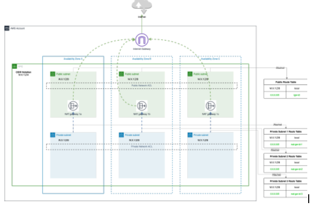

# Terraform VPC Module

This Terraform module creates a Virtual Private Cloud (VPC) along with the corresponding subnets, route tables, and network ACLs (NACLs).



## Features

- Creates a VPC with a customizable CIDR block.
- Handles the Availability Zones (AZ) according to the number of public/private subnets or vice-versa.
- Configures route tables for public and private subnets.
- Configures Network ACLs for enhanced security.

## Usage

```hcl
module "vpc" {
  source = "path_to_your_module"

  # VPC Configuration
  name = "my-project"
  cidr = "10.0.0.0/16"
  azs  = ["us-west-2a", "us-west-2b", "us-west-2c"]

  # Tags
  tags = {
    Environment = "dev"
    Project     = "my-project"
  }
}
```

## Examples

- [VPC Only](https://github.com/fedepazos95/terraform-aws-vpc/blob/main/examples/without-subnets/main.tf)
- [VPC from Subnets](https://github.com/fedepazos95/terraform-aws-vpc/blob/main/examples/from-azs/main.tf)
- [VPC from AZs](https://github.com/fedepazos95/terraform-aws-vpc/blob/main/examples/from-azs/main.tf)

## Contributing

Report issues/questions/feature requests on in the [issues](https://github.com/terraform-aws-modules/terraform-aws-vpc/issues/new) section.

<!-- BEGINNING OF PRE-COMMIT-TERRAFORM DOCS HOOK -->
## Requirements

| Name | Version |
|------|---------|
| <a name="requirement_terraform"></a> [terraform](#requirement\_terraform) | >= 1.8 |
| <a name="requirement_aws"></a> [aws](#requirement\_aws) | ~> 5.0 |

## Providers

| Name | Version |
|------|---------|
| <a name="provider_aws"></a> [aws](#provider\_aws) | ~> 5.0 |

## Modules

No modules.

## Resources

| Name | Type |
|------|------|
| [aws_default_network_acl.default](https://registry.terraform.io/providers/hashicorp/aws/latest/docs/resources/default_network_acl) | resource |
| [aws_default_route_table.default](https://registry.terraform.io/providers/hashicorp/aws/latest/docs/resources/default_route_table) | resource |
| [aws_eip.nat](https://registry.terraform.io/providers/hashicorp/aws/latest/docs/resources/eip) | resource |
| [aws_internet_gateway.this](https://registry.terraform.io/providers/hashicorp/aws/latest/docs/resources/internet_gateway) | resource |
| [aws_nat_gateway.this](https://registry.terraform.io/providers/hashicorp/aws/latest/docs/resources/nat_gateway) | resource |
| [aws_network_acl.private](https://registry.terraform.io/providers/hashicorp/aws/latest/docs/resources/network_acl) | resource |
| [aws_network_acl.public](https://registry.terraform.io/providers/hashicorp/aws/latest/docs/resources/network_acl) | resource |
| [aws_route_table.private](https://registry.terraform.io/providers/hashicorp/aws/latest/docs/resources/route_table) | resource |
| [aws_route_table.public](https://registry.terraform.io/providers/hashicorp/aws/latest/docs/resources/route_table) | resource |
| [aws_route_table_association.private](https://registry.terraform.io/providers/hashicorp/aws/latest/docs/resources/route_table_association) | resource |
| [aws_route_table_association.public](https://registry.terraform.io/providers/hashicorp/aws/latest/docs/resources/route_table_association) | resource |
| [aws_subnet.private](https://registry.terraform.io/providers/hashicorp/aws/latest/docs/resources/subnet) | resource |
| [aws_subnet.public](https://registry.terraform.io/providers/hashicorp/aws/latest/docs/resources/subnet) | resource |
| [aws_vpc.this](https://registry.terraform.io/providers/hashicorp/aws/latest/docs/resources/vpc) | resource |
| [aws_availability_zones.available](https://registry.terraform.io/providers/hashicorp/aws/latest/docs/data-sources/availability_zones) | data source |

## Inputs

| Name | Description | Type | Default | Required |
|------|-------------|------|---------|:--------:|
| <a name="input_azs"></a> [azs](#input\_azs) | A list of availability zones names or ids in the region | `list(string)` | `[]` | no |
| <a name="input_cidr"></a> [cidr](#input\_cidr) | (Optional) The IPv4 CIDR block for the VPC | `string` | `"10.0.0.0/16"` | no |
| <a name="input_igw_tags"></a> [igw\_tags](#input\_igw\_tags) | Additional tags for the Internet Gateway | `map(string)` | `{}` | no |
| <a name="input_name"></a> [name](#input\_name) | Name to be used on all the resources as identifier | `string` | `""` | no |
| <a name="input_nat_eip_tags"></a> [nat\_eip\_tags](#input\_nat\_eip\_tags) | Additional tags for the NAT EIP | `map(string)` | `{}` | no |
| <a name="input_nat_gateway_destination_cidr_block"></a> [nat\_gateway\_destination\_cidr\_block](#input\_nat\_gateway\_destination\_cidr\_block) | Used to pass a custom destination route for private NAT Gateway. If not specified, the default 0.0.0.0/0 is used as a destination route | `string` | `"0.0.0.0/0"` | no |
| <a name="input_nat_gateway_tags"></a> [nat\_gateway\_tags](#input\_nat\_gateway\_tags) | Additional tags for the NAT gateways | `map(string)` | `{}` | no |
| <a name="input_private_acl_tags"></a> [private\_acl\_tags](#input\_private\_acl\_tags) | Additional tags for the private subnets network ACL | `map(string)` | `{}` | no |
| <a name="input_private_inbound_acl_rules"></a> [private\_inbound\_acl\_rules](#input\_private\_inbound\_acl\_rules) | Private subnets inbound network ACLs | `list(map(string))` | <pre>[<br>  {<br>    "action": "allow",<br>    "cidr_block": "0.0.0.0/0",<br>    "from_port": 0,<br>    "number": 100,<br>    "protocol": "-1",<br>    "to_port": 0<br>  }<br>]</pre> | no |
| <a name="input_private_outbound_acl_rules"></a> [private\_outbound\_acl\_rules](#input\_private\_outbound\_acl\_rules) | Private subnets outbound network ACLs | `list(map(string))` | <pre>[<br>  {<br>    "action": "allow",<br>    "cidr_block": "0.0.0.0/0",<br>    "from_port": 0,<br>    "number": 100,<br>    "protocol": "-1",<br>    "to_port": 0<br>  }<br>]</pre> | no |
| <a name="input_private_route_table_tags"></a> [private\_route\_table\_tags](#input\_private\_route\_table\_tags) | Additional tags for the Private Route Table | `map(string)` | `{}` | no |
| <a name="input_private_subnet_names"></a> [private\_subnet\_names](#input\_private\_subnet\_names) | Explicit values to use in the Name tag on private subnets. If empty, Name tags are generated | `list(string)` | `[]` | no |
| <a name="input_private_subnet_suffix"></a> [private\_subnet\_suffix](#input\_private\_subnet\_suffix) | Suffix to append to private subnets name | `string` | `"private"` | no |
| <a name="input_private_subnet_tags"></a> [private\_subnet\_tags](#input\_private\_subnet\_tags) | Additional tags for the private subnets | `map(string)` | `{}` | no |
| <a name="input_private_subnets"></a> [private\_subnets](#input\_private\_subnets) | A list of private subnets inside the VPC | `list(string)` | `[]` | no |
| <a name="input_public_acl_tags"></a> [public\_acl\_tags](#input\_public\_acl\_tags) | Additional tags for the public subnets network ACL | `map(string)` | `{}` | no |
| <a name="input_public_inbound_acl_rules"></a> [public\_inbound\_acl\_rules](#input\_public\_inbound\_acl\_rules) | Public subnets inbound network ACLs | `list(map(string))` | <pre>[<br>  {<br>    "action": "allow",<br>    "cidr_block": "0.0.0.0/0",<br>    "from_port": 0,<br>    "number": 100,<br>    "protocol": "-1",<br>    "to_port": 0<br>  }<br>]</pre> | no |
| <a name="input_public_outbound_acl_rules"></a> [public\_outbound\_acl\_rules](#input\_public\_outbound\_acl\_rules) | Public subnets outbound network ACLs | `list(map(string))` | <pre>[<br>  {<br>    "action": "allow",<br>    "cidr_block": "0.0.0.0/0",<br>    "from_port": 0,<br>    "number": 100,<br>    "protocol": "-1",<br>    "to_port": 0<br>  }<br>]</pre> | no |
| <a name="input_public_route_table_tags"></a> [public\_route\_table\_tags](#input\_public\_route\_table\_tags) | Additional tags for the Public Route Table | `map(string)` | `{}` | no |
| <a name="input_public_subnet_names"></a> [public\_subnet\_names](#input\_public\_subnet\_names) | Explicit values to use in the Name tag on public subnets. If empty, Name tags are generated | `list(string)` | `[]` | no |
| <a name="input_public_subnet_suffix"></a> [public\_subnet\_suffix](#input\_public\_subnet\_suffix) | Suffix to append to public subnets name | `string` | `"public"` | no |
| <a name="input_public_subnet_tags"></a> [public\_subnet\_tags](#input\_public\_subnet\_tags) | Additional tags for the public subnets | `map(string)` | `{}` | no |
| <a name="input_public_subnets"></a> [public\_subnets](#input\_public\_subnets) | A list of public subnets inside the VPC. If 'azs' is specified this variable will be ignored | `list(string)` | `[]` | no |
| <a name="input_tags"></a> [tags](#input\_tags) | A map of tags to add to all resources | `map(string)` | `{}` | no |
| <a name="input_vpc_tags"></a> [vpc\_tags](#input\_vpc\_tags) | Additional tags for the VPC | `map(string)` | `{}` | no |

## Outputs

| Name | Description |
|------|-------------|
| <a name="output_igw_id"></a> [igw\_id](#output\_igw\_id) | The ID of the Internet Gateway |
| <a name="output_nat_ids"></a> [nat\_ids](#output\_nat\_ids) | List of allocation ID of Elastic IPs created for AWS NAT Gateway |
| <a name="output_nat_public_ips"></a> [nat\_public\_ips](#output\_nat\_public\_ips) | List of public Elastic IPs created for AWS NAT Gateway |
| <a name="output_natgw_ids"></a> [natgw\_ids](#output\_natgw\_ids) | List of NAT Gateway IDs |
| <a name="output_private_network_acl_id"></a> [private\_network\_acl\_id](#output\_private\_network\_acl\_id) | ID of the private network ACL |
| <a name="output_private_route_table_ids"></a> [private\_route\_table\_ids](#output\_private\_route\_table\_ids) | List of IDs of private route tables |
| <a name="output_private_subnets"></a> [private\_subnets](#output\_private\_subnets) | List of IDs of private subnets |
| <a name="output_private_subnets_cidr_blocks"></a> [private\_subnets\_cidr\_blocks](#output\_private\_subnets\_cidr\_blocks) | List of cidr\_blocks of private subnets |
| <a name="output_public_network_acl_id"></a> [public\_network\_acl\_id](#output\_public\_network\_acl\_id) | ID of the public network ACL |
| <a name="output_public_route_table_id"></a> [public\_route\_table\_id](#output\_public\_route\_table\_id) | The ID of the Public Route Table |
| <a name="output_public_subnets"></a> [public\_subnets](#output\_public\_subnets) | List of IDs of public subnets |
| <a name="output_public_subnets_cidr_blocks"></a> [public\_subnets\_cidr\_blocks](#output\_public\_subnets\_cidr\_blocks) | List of cidr\_blocks of public subnets |
| <a name="output_vpc_cidr_block"></a> [vpc\_cidr\_block](#output\_vpc\_cidr\_block) | The CIDR block of the VPC |
| <a name="output_vpc_id"></a> [vpc\_id](#output\_vpc\_id) | The ID of the VPC |
<!-- END OF PRE-COMMIT-TERRAFORM DOCS HOOK -->
